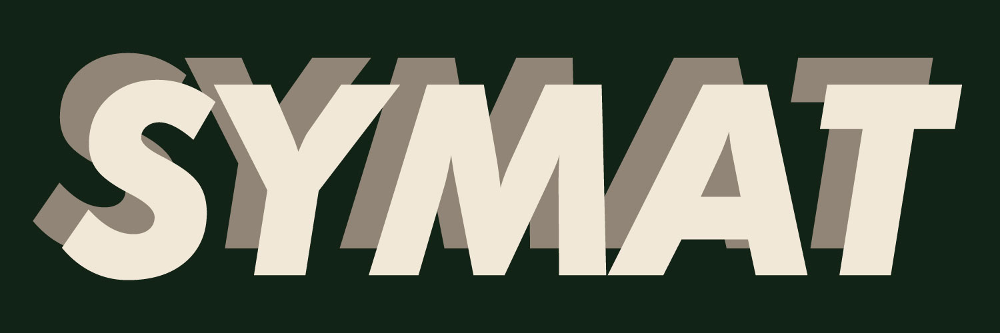

# Hi, I'm Symat! 

Based in France, I am currently an apprentice in the field of web development and creative dev. My journey is deeply rooted in my passions for art, cinema, and sport, which I seamlessly integrate into my other passion: development. With an eye for both aesthetics and functionality, I strive to bring these elements into the web solutions I craft.

My approach to web development is focused on creating lightweight, efficient websites using modern frameworks such as React and Angular. I understand the importance of accessibility and ease of use for end-users, which is why I also specialize in developing with WordPress. Its user-friendly nature makes it an ideal platform for clients who wish to maintain their websites post-launch, while its flexibility allows for easy optimization and enhancements.

In addition to these technologies, I have experience working with CakePHP, further diversifying my skill set to cater to a broad range of development needs. My goal is to deliver simple yet powerful web solutions, boosting visibility through strategic SEO and performance optimization.

Discover how I can bring your vision to life, creating a web experience that is not only memorable but also highly functional and user-centric.

<h2 align="center">My Techs & Tools</h2>

<h2 align="center">My GitHub Stats</h2>

    
    

